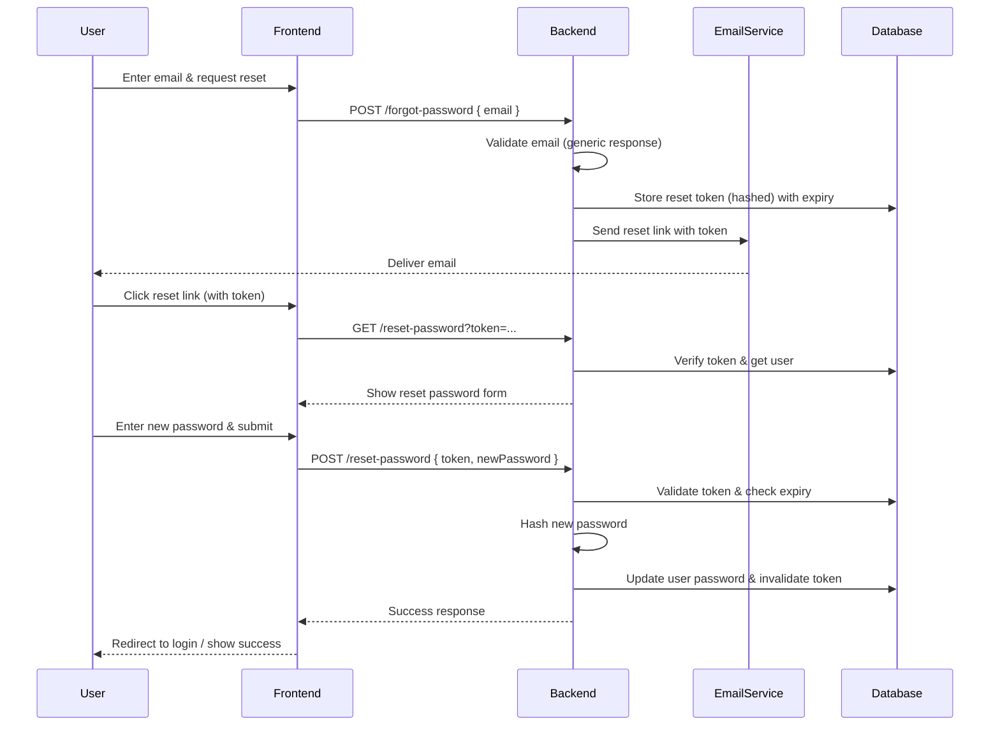

# The Password Reset Workflow

#### 1. User Request

The user navigates to a "Forgot Password" page, enters their registered email address, and submits the form.

#### 2. Backend Validation

The backend receives the request, validates that the email exists in the system, and ensures the account is active (not
locked or deleted).
(For security, it should not reveal whether the email exists; always return a generic "If this email is registered, a
reset link will be sent" message.)

#### 3. Token Generation & Storage

The backend generates a secure, cryptographically random token, associates it with the user's account, and stores a hash
of it (along with an expiration timestamp) in the database.
Any previously issued reset tokens for that user are invalidated to prevent token reuse.

#### 4. Email Delivery

The backend sends an email to the user's address containing a link with the reset token.

#### 5. User Clicks the Link

The user opens the email and clicks the link, which navigates them to the "Reset Password" page (with the token
prefilled in the URL).

#### 6. User Sets New Password

On the reset page, the user enters a new password (and often a confirmation field). They submit the form.

#### 7. Backend Verifies Token & Updates Password

The backend receives the token and the new password. It verifies that:

- The token exists and is valid (not expired).
- The token matches the stored hash.
- The token hasn't been used before (single use).

If all checks pass, the backend hashes the new password, updates the user's record, and invalidates the token (so it
cannot be used again).

#### 8. Success Response

The backend confirms the password change. The user is usually redirected to the login page with a success message.

