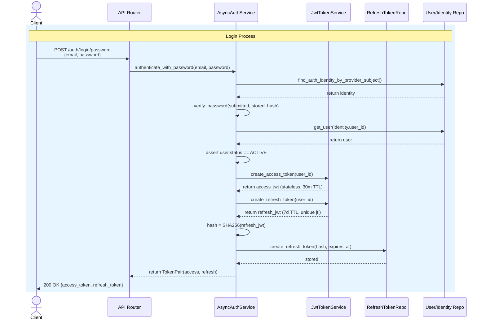

# Login Process

#### 1. Credential Submission

The client sends the user's email and password to POST /auth/login/password.

#### 2. Identity Lookup

The backend finds the auth identity by provider (password) and subject (normalized email).

#### 3. Password Verification

The submitted password is hashed using the configured hasher (for example: Argon2) and compared against the stored hash.

#### 4. Status Check

The backend verifies the user's account status is ACTIVE; inactive or deleted accounts are rejected.

#### 5. Access Token Issuance

A stateless JWT access token is created containing the user ID, a short TTL (default 30 min), and a unique jti claim.

#### 6. Refresh Token Issuance

A stateless JWT refresh token is created with a longer TTL (default 7 days), and its SHA-256 hash is stored in the
database for server-side revocation.

#### 7. Token Delivery

Both tokens are returned to the client as a TokenPairResponse.

