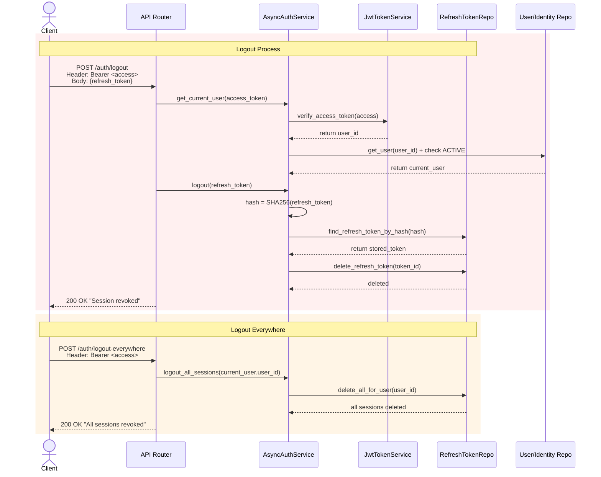

# Logout Process

#### 1. Logout Request

The client sends the refresh token to POST /auth/logout along with a valid Bearer access token in the header.

#### 2. Access Token Verification

The backend verifies the Bearer access token's signature, expiry, and type to authenticate the requesting user.

#### 3. Refresh Token Revocation

The backend hashes the provided refresh token and deletes the matching row from the database, instantly invalidating
that specific session.

#### 4. Confirmation

The backend returns a success response; subsequent attempts to use the revoked refresh token at /auth/refresh will be
rejected.

#### 5. Logout Everywhere (Optional)

If the client calls POST /auth/logout-everywhere, the backend deletes all stored refresh token hashes for the
authenticated user, revoking every active session across all devices.

