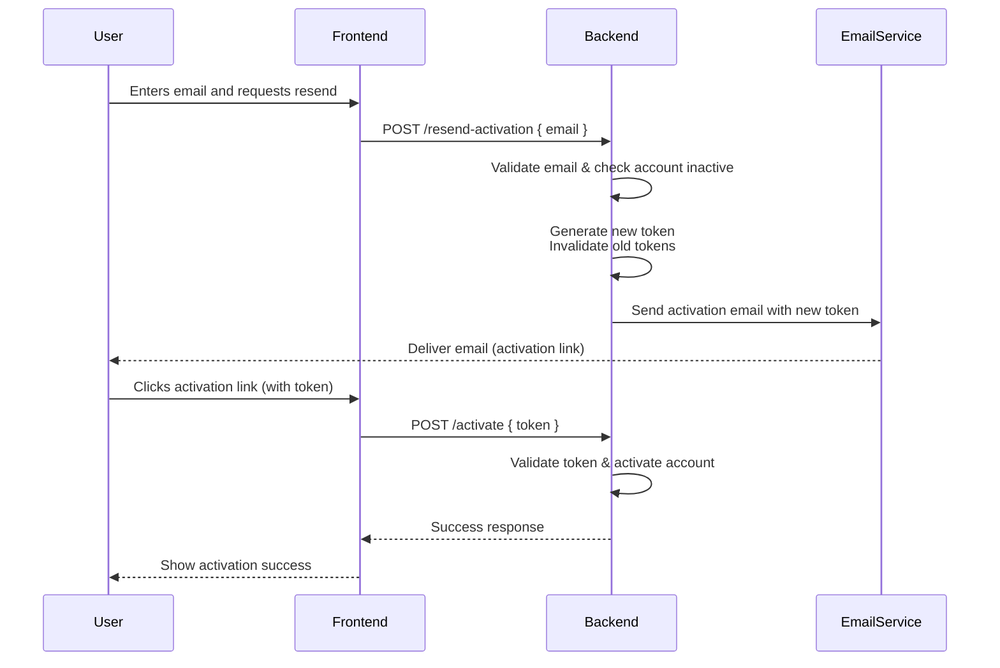

# The "Resend Activation" Workflow

**1. User Request:** The user navigates to a "Resend Activation" or "Request New Token" page and enters their registered email address.

**2. Backend Validation:** The backend receives the request, validates the email, and checks if the associated account is in an inactive state.

**3. Token Generation & Invalidation:** The backend generates a new, time-limited (30 mins) activation token. For security, it invalidates any previously issued tokens for that account.

**4. Email Delivery:** The backend sends a new activation email to the user's address, containing a link with the fresh token.

**5. User Action:** The user receives the email and clicks the new activation link.

**6. Activation:** The backend validates the new token, activates the account, and marks the token as used (single-use).

