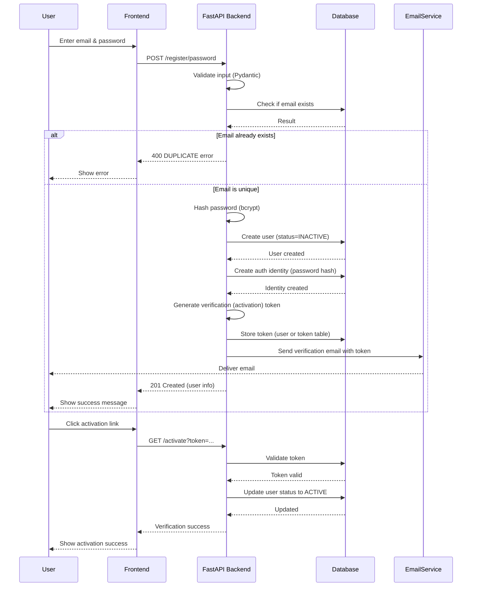

# Step-by-Step Registration Workflow with Activation

**1. User Input (Frontend):** The user enters an email address and a password into the sign-up form.

**2. Data Validation (Backend/Frontend):** The system checks if the email format is valid and ensures the password meets security rules (e.g., minimum/maximum lengths).

**3. Uniqueness Check (Backend):** The server queries the database to confirm the email is not already registered.

**4. Password Hashing (Backend):** The system securely hashes the password using a strong algorithm like bcrypt or Argon2. It never stores plain text.

**5. Account Creation & Token Generation (Backend):** A new user record is saved with a status of inactive. A unique, time-limited verification token or one-time code is generated and saved.

**6. Verification Dispatch (Backend):** An email service sends a confirmation link or code containing the unique token to the user's provided email address.

**7. Account Activation (Verification):** The user clicks the link or enters the code, the server validates the token against the database, updates the user status to active, and logs the user in.

